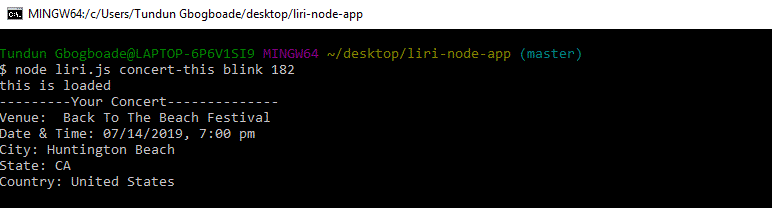

# LIRI

LIRI is a Language Interpretation and Recognition Interface. LIRI is a command line node app that takes in parameters and gives you back data.

## APIs used:
* Spotify
* Bands in Town Events API
* OMDb API

## Packages used:
* node-spotify-api
* Axios
* Moment.js
* fs
* dotenv is used to store the relevant api keys in a separate file for security.

## spotify-this-song
node liri.js `spotify-this-song` <song-name>

Uses the node-spotify-api to get song data from Spotify and displays the following information:

* Artist(s)
* The song's name
* A preview link of the song from Spotify
* The album that the song is from
If no song name is provided, it will display the results for "The Sign" by Ace of Base.

## movie-this
node liri.js `movie-this` <movie-title>

Uses Axios to get movie data from the OMDb API and outputs the movie's data to the terminal:

- Title
- Year produced
- IMDB Rating
- Rotten Tomatoes Rating
- Country where produced
- Language
- Plot
- Cast

If no movie title is provided, it will display the results for "Mr. Nobody"

## concert-this 
node liri.js `concert-this` <band-name>

Uses Axios to retrieve concert data from the Bands in Town Events API. It displays the following information about each show in the terminal:

* Venue name
* Venue location
* Show date and Time (uses moment.js to format date and time)

